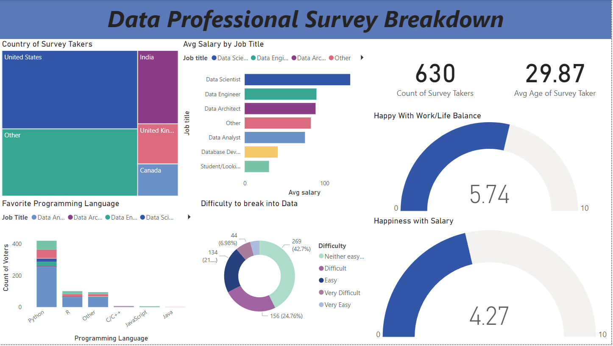

# Data Professional Survey Breakdown Dashboard

## Overview
This Power BI dashboard provides insights into the experiences and preferences of data professionals around the world. It covers various aspects such as average salary by job title, popular programming languages, work-life balance satisfaction, and more. This project combines data visualization with storytelling to uncover trends and insights in the data profession.

## Features
- 🌍 **Country Distribution**: A treemap showing the breakdown of survey takers by country.
- 💼 **Average Salary by Job Title**: Bar chart representing average salaries for different data roles like Data Scientist, Data Engineer, Data Analyst, and more.
- 📊 **Programming Language Preferences**: A bar chart visualizing the favorite programming languages of survey respondents.
- 💪 **Work-Life Balance & Salary Satisfaction**: Gauges displaying average scores for work-life balance and salary satisfaction among data professionals.
- 📈 **Difficulty of Breaking into the Field**: A donut chart showing how survey takers rate the difficulty of entering the data industry.

## Technologies Used

This project was developed using the following tools and technologies:

- : For data visualization and interactive dashboard creation.
- : For data cleaning and initial analysis.

## Data Preparation
- **Dataset**: The survey data contains information on data professionals' roles, salaries, country, programming languages, and job satisfaction.
- **Data Cleaning**: The data was cleaned and organized in Excel before importing into Power BI for visualization.
- **Calculations**:
  - **Average Salary**: Calculated the average salary by job title.
  - **Average Satisfaction Scores**: Created measures for average work-life balance and salary satisfaction.
  - **Difficulty Breakdown**: Organized responses on the difficulty of breaking into the field.

## Visualizations
1. **Country of Survey Takers**: Treemap visualizing the distribution of respondents by country.
2. **Average Salary by Job Title**: Bar chart showing the average salary by role.
3. **Favorite Programming Language**: Bar chart representing the count of votes for each programming language.
4. **Work-Life Balance and Salary Satisfaction**: Gauges displaying average scores for satisfaction metrics.
5. **Difficulty to Break into Data Field**: Donut chart summarizing survey responses on the ease or difficulty of entering the data field.

### Full Dashboard Overview

## Getting Started
1. **Download the Power BI File**:
   - Download the `.pbix` file from this repository to explore the dashboard in Power BI Desktop.
2. **Data Source**:
   - The data used in this dashboard can be substituted if not available, but should contain similar fields (Job Title, Salary, Country, Programming Language, etc.).

## Insights
This dashboard offers valuable insights into the data profession, such as:
- The **United States** has the largest number of survey takers.
- **Data Scientist** and **Data Engineer** roles command the highest average salaries.
- **Python** is the most popular programming language among data professionals.
- There is a moderate level of satisfaction with work-life balance and salary in the industry.
- The **difficulty of breaking into data** is most commonly rated as “Neither easy nor difficult.”

## Challenges and Solutions
- **Data Cleaning**: Raw data required significant cleaning in Excel to ensure accuracy in visualizations.
- **Dynamic Measures**: Measures for average salary, work-life balance, and difficulty ratings were created to provide flexible insights across the dashboard.

## Conclusion
The Data Professional Survey Breakdown dashboard provides a comprehensive view of trends and preferences within the data industry. Through interactive visualizations, users can gain insights into salaries, programming languages, and job satisfaction among data professionals worldwide. This dashboard aims to serve as a valuable tool for both professionals and organizations within the data field.

